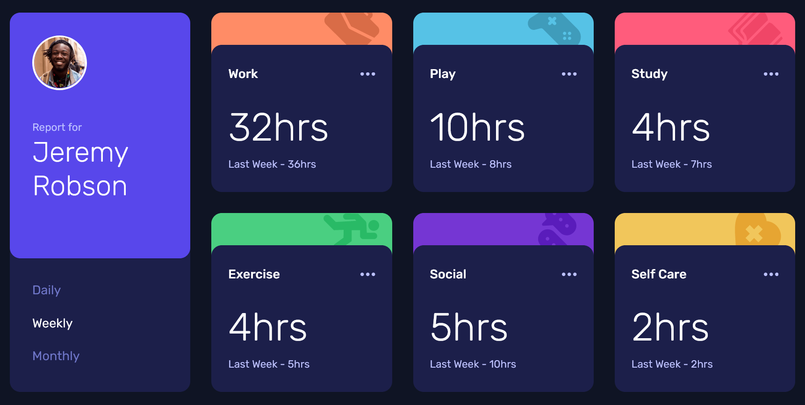

# Frontend Mentor - Time tracking dashboard solution

This is a solution to the [Time tracking dashboard challenge on Frontend Mentor](https://www.frontendmentor.io/challenges/time-tracking-dashboard-UIQ7167Jw). Frontend Mentor challenges help you improve your coding skills by building realistic projects. 

## Table of contents

- [Overview](#overview)
  - [The challenge](#the-challenge)
  - [Screenshot](#screenshot)
  - [Links](#links)
- [My process](#my-process)
  - [Built with](#built-with)
  - [Useful resources](#useful-resources)
- [Author](#author)

## Overview

### The challenge

Users should be able to:

- View the optimal layout for the site depending on their device's screen size
- See hover states for all interactive elements on the page
- Switch between viewing Daily, Weekly, and Monthly stats

### Screenshot

### Links

- [Frontend Mentor Solution Page](https://www.frontendmentor.io/solutions/interactive-dashboard-using-css-grid-and-javascript-Sd_f4L6Iw4)
- [Live Site URL](https://time-tracking-dashboard-one-tan.vercel.app/)

## My process

### Built with

- Semantic HTML5 markup
- CSS custom properties
- Flexbox
- CSS Grid
- Mobile-first workflow
- JavaScript

### Useful resources

- [Kevin Powell CSS Grid videos](https://www.youtube.com/playlist?list=PL4-IK0AVhVjPv5tfS82UF_iQgFp4Bl998) - CSS Grid is an obvious choice for the primary layout of this project and Kevin Powell's videos on the subject have been an essential resource for me. This playlist contains just about everything you need to know about Grid in a logical sequence.

## Author

- Website - [Matt Pahuta](https://www.mattpahuta.com)
- Frontend Mentor - [@mattpahuta](https://www.frontendmentor.io/profile/MattPahuta)
- Twitter - [@mattpahuta](https://www.twitter.com/MattPahuta)
